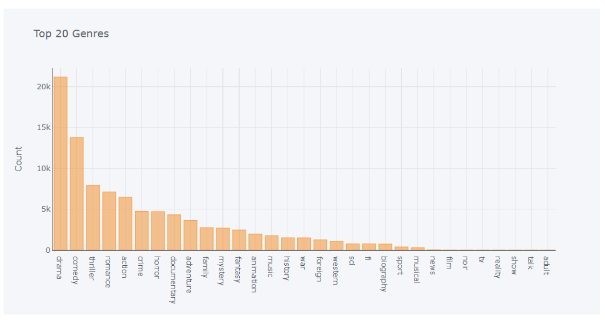
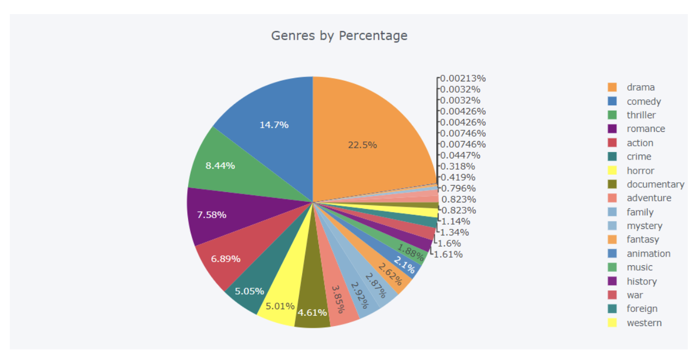
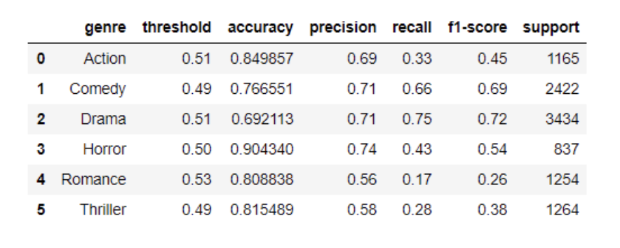
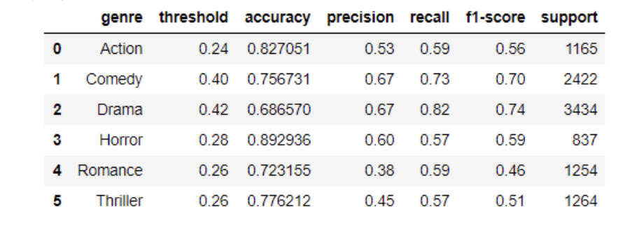
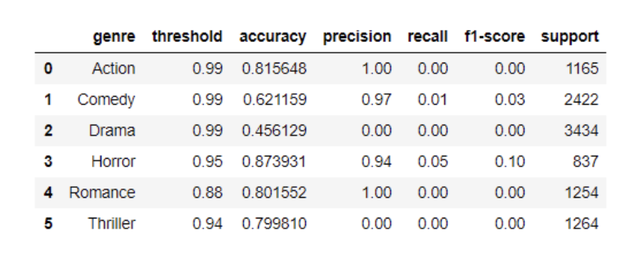
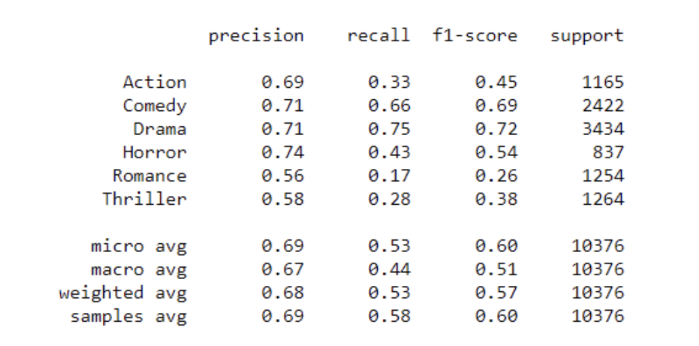
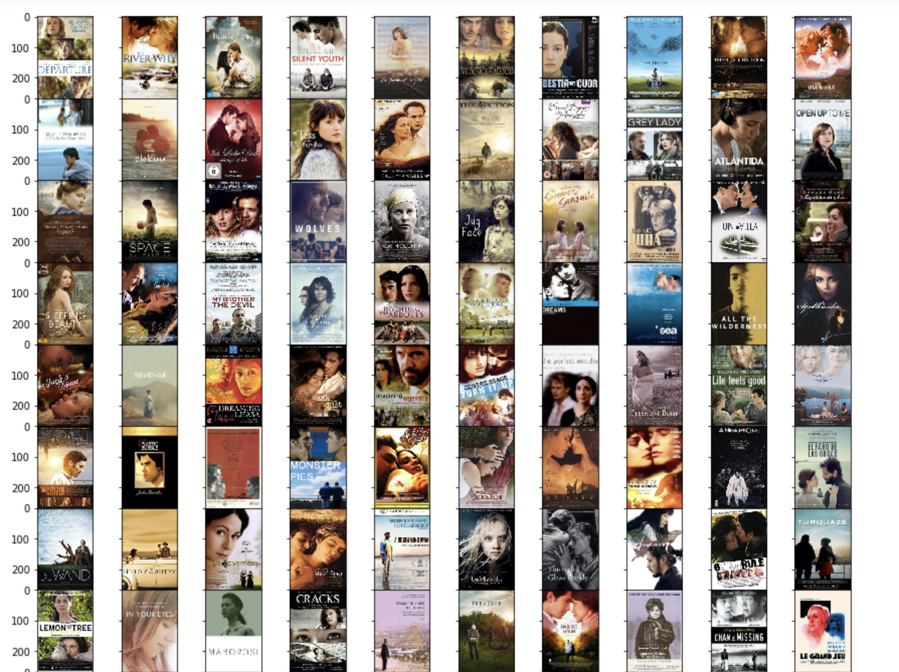
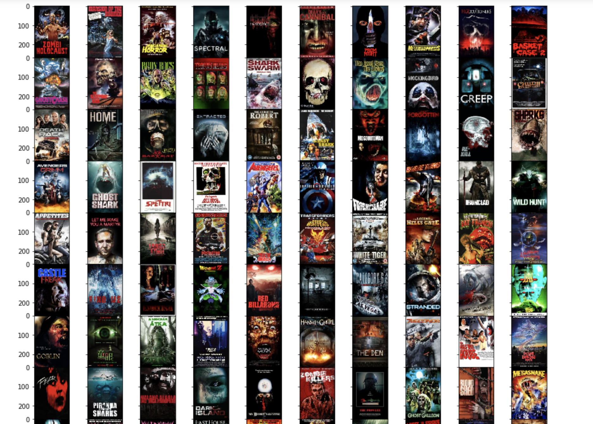
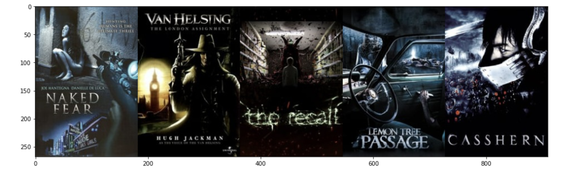

## Movie Genre Prediction

The objective is to develop a model that can classify movies according to their genre by looking at their poster. Movies can belong to multiple genres. A movie can be a comical drama or a romantic comedy, it may be an action-comedy too. And hence, it was important to construct this problem as a multi label classification problem and not a multi-class problem. I have used the resNet50 architecture as developed in the paper Deep Residual Learning for Image Recognition bby He et. al.

## Dataset

Two datasets have been combined to train the model. One being a small dataset with 11569 movies and a larger dataset with 45417 movies. The two datasets combined contain 46213 unique movies which means there are 10773 movies in common. Further on removing bad poster images I finally retain 44370 records.The smaller dataset contains metadata that will help us associate poster design and box office performance with genre prediction. The larger dataset has been obtained from kaggle (https://www.kaggle.com/rounakbanik/the-movies-dataset#movies_metadata.csv) to augment the smaller dataset with more training data. This dataset contains imdb_ids (An identifier used by imdb to identify each movie uniquely). The posters for this dataset have been obtained by scraping images from http://image.tmdb.org .

Another point to note about the labels is that the genres tagged for a movie are in their order of importance. The genres in these datasets were populated from imdb which collects genres from users. So if a movie is tagged with the following three genres Action, Comedy, Drama in the same order then it would mean that the most significant genre for the movie is the first genre listed that is, Action. Similarly, the second most significant genre would be comedy and the third would be drama.

> Note: Please update the path of the dataset after downloading it from the link mentioned above 

## Data Preprocessing

The movies in the combined dataset are tagged across 25 genres. I first visualize the genre distribution across movies. The distribution looks as follows:

To remove noise and for better understanding and comparison of important genres I have considered 6 genres namely - Drama, Comedy, Romance, Thriller, Horror and Action. Post selecting the aforementioned genres, movies are selected to retain from the combined dataset for the analysis. To do this all movies that have their first listed genre as one of the aforementioned genres considered are retained and the rest are discarded. Among the retained movies if one of the tagged genres is outside of this considered genre list I simply drop the genre but retain the movie for its other genres within this list. So if a movie is tagged as Drama, Romance, Family and Animation, I keep the movie entry and tag it as just Drama and Romance. This leaves us with 31569 movies.

To maintain consistency I have resized all the posters initially to 278x185 pixel sizes. Since training resNet50 is initialized by weights pre-trained on the Imagenet dataset I transform this images by the standard Imagenet transformations.

Following this dataset is split into training, validation and test sets in a 64:16:20 ratio

## Model Setup 

The model is a resNet 50. I initialize the model by weights that have been pre-trained on the imagenet dataset before training it on this own data. This allows training the model for shorter periods of time.

I train this model for 12 epochs with a batch size of 64.

## Results and Interpretation

After training I evaluate the model’s performance on the test data using AUCs, F-1 scores, precision, recall, jaccard scores and subsets accuracy. The test data has 6314 movies.

Checking AUCs on the validation set and determine probability thresholds for each genre from the validation set as described below. Post obtaining thresholds I move on to checking results and determine model accuracy on the test set.

The overall AUC (macro AUC) on the validation set obtained across all genres is 80.3%. Other AUC metrics look as follows:

Since this model returns probability vectors for each movie I first need to identify thresholds for each genre’s activation. I do this by performing a grid search on the validation set for thresholds that optimize across accuracy, f-1 score, precision and recall separately for each genre. The obtained thresholds are then applied to the test set to check the results.

Results on applying accuracy optimized thresholds from validation set to test set:

Results on applying f-1 score optimized thresholds from validation set to test set:

Results on applying precision optimized thresholds from validation set to test set:

I choose the accuracy optimized thresholds to obtain the following final metrics on the test set.

The following training and validation diagnostics are yielded:

## Images Similarity Plot

Top 100 Movies with highest probability of Romantic genre

Top 100 Movies with highest probability of Horror genre

## Embeddings Similarity (extracted from 2nd to last layer of Resnet Model)

